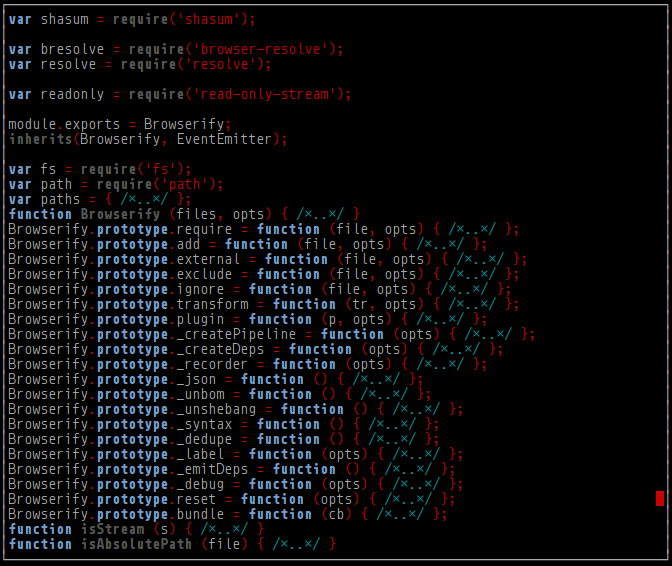

[](https://nodei.co/npm/much/)

# much

[![Dependency Status][david-badge]][david]

[david-badge]: https://david-dm.org/eush77/much.png
[david]: https://david-dm.org/eush77/much

`much` — pager with depth support.

Fold JavaScript functions, objects and blocks interactively in the pager.

## Example

```
$ much browserify.js
```



## CLI

#### `$ much [<file>]`

Consumes `stdin` by default.

## Controls

### Basic

| key                             | description
| :-----------------------------: | -----------
| <kbd>q</kbd>, <kbd>Ctrl+c</kbd> | Quit.
| <kbd>Ctrl+z</kbd>               | Suspend.

### Scrolling

| key                           | description
| :---------------------------: | -----------
| <kbd>down</kbd>, <kbd>j</kbd> | Scroll down.
| <kbd>up</kbd>, <kbd>k</kbd>   | Scroll up.
| <kbd>d</kbd>                  | Scroll half the screen down.
| <kbd>u</kbd>                  | Scroll half the screen up.
| <kbd>g</kbd>                  | Scroll to top.
| <kbd>G</kbd>                  | Scroll to bottom.

### Code Folding

| key                                  | description
| :----------------------------------: | -----------
| <kbd>left</kbd>, <kbd>h</kbd>        | Fold code.
| <kbd>right</kbd>, <kbd>l</kbd>       | Unfold code.
| <kbd>Shift+left</kbd>, <kbd>H</kbd>  | Fold all.
| <kbd>Shift+right</kbd>, <kbd>L</kbd> | Unfold all.

### Search

| key              | description
| :--------------: | -----------
| <kbd>/</kbd>     | Search forward.
| <kbd>n</kbd>     | Scroll to next occurrence.
| <kbd>N</kbd>     | Scroll to previous occurrence.
| <kbd>ESC-u</kbd> | Clear search highlighting.

## $LESSOPEN

`much` supports `$LESSOPEN` variable in the same manner as `less(1)`. This allows for preprocessing step before pager displays file contents. See `less(1)` manual for details.

For example, include the following line in the shell config to highlight files with `source-highlight(1)`:

```bash
LESSOPEN="| src-hilite-lesspipe.sh %s"
```

## Install

```shell
npm install -g much
```

## License

MIT
